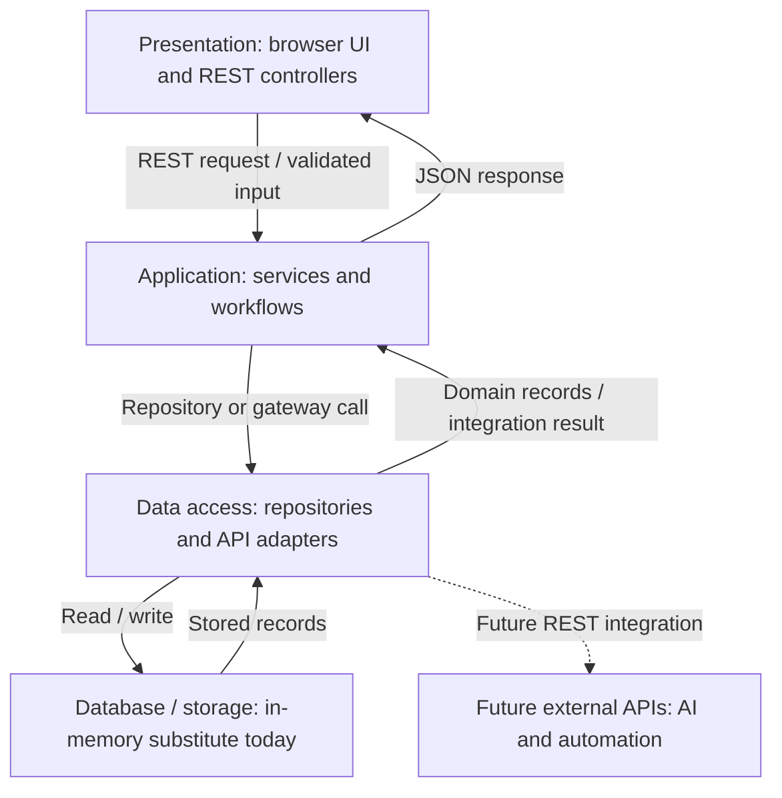

# Steps 2–4 — Four-Tier Architecture

## Architecture explanation

Hikyu Bank is a web application for exploring synthetic personal finance data.
Version 2 already separated many JavaScript files, but several API modules still
combined interface behavior, business rules and browser storage. This refactor
establishes four logical tiers and two top-level development folders: frontend
and backend. Logical tiers do not require four separate servers. The local MVP
runs one Spring Boot process that serves both static UI files and REST endpoints.
This simplifies demonstration while retaining explicit code boundaries.

### 1. Presentation layer

The presentation layer includes HTML pages, CSS, reusable JavaScript components
and screen modules in frontend. Login and verification remain separate pages.
Dashboard navigation mounts Overview, Transactions or the assistant view.
The browser formats values, filters displayed transactions and shows loading,
error and empty states. API adapters serialize form data and consume JSON; they
contain no banking eligibility rules or stored account records. Spring REST
controllers under web form the HTTP boundary of this tier. They validate request
shape, delegate work to application services and return responses with appropriate
HTTP status codes. Controllers do not read storage maps.

### 2. Application logic layer

Application services coordinate business rules and workflows. AuthService checks
hashed demo credentials, creates expiring challenges, verifies one-time codes and
checks the email PIN requirement. AccountService rejects additional checking or
savings accounts even when someone sends a request directly to the API. Other
product applications remain pending. AlertService validates amounts, dates and
account references; NotificationService handles test creation, read status and
resolution. AssistantService retrieves the current account and transaction data
before invoking its gateway. Immutable records and DTOs express contracts.
Constructor injection supplies repositories, gateways and a clock, allowing
services to be tested without tying them to servlet or storage implementations.

### 3. Data access layer

Repository interfaces define how services find and save accounts, transactions,
alerts, inbox messages and the demo user. Memory repository adapters implement
these contracts and synchronize access to the backing store. This layer hides
map operations from business code. AssistantGateway is an integration port. The current deterministic implementation,
RuleBasedAssistantGateway, lives in the application layer because its spending
calculations are business logic. A future data-access adapter could call an
external REST AI provider from the backend. Provider credentials
would remain outside frontend JavaScript. Bubble or Zapier could consume documented
REST endpoints through controlled integration adapters, rather than bypassing
application rules and writing to storage directly.

### 4. Database / storage layer

The architecture assigns actual record storage to its fourth tier. Following the
requested scope, this implementation substitutes MemoryDatabase for a database.
It loads the original synthetic account, transaction and alert records from
seed/demo-data.json into process memory. Changes survive page refreshes while the
server runs and reset after restart. There is no JDBC, JPA, SQL schema, database
server or durable persistence. This is a storage-layer implementation and a
reserved database boundary, not a claim that a real database has been implemented.
Later, database repository adapters can replace memory adapters while retaining
the service contracts. Durable account uniqueness, migrations and transactional
updates would then become explicit database responsibilities.

### Request and response flow

For account opening, the browser first requests account products and availability.
The service derives availability from stored accounts through its repository.
When the form submits, the browser sends POST /api/v1/accounts. The HTTP boundary
checks the authenticated session and request shape. AccountService rechecks
eligibility, then calls AccountRepository.save. The adapter writes the new record
to MemoryDatabase and returns an immutable Account. The controller returns JSON
with status 201; the browser refreshes Overview. A duplicate is rejected with 409
and a stable error code. Responses travel back through the same boundaries.

### Scalability, maintenance and deployment

Separating display code from authoritative rules reduces duplicated validation
and makes each module easier to understand. Storage and AI providers can change
behind contracts without rewriting account cards or forms. UI components and
services have different test responsibilities. The current single-origin server
avoids cross-origin cookie configuration and serves a self-contained JAR.
Future deployment can host the UI separately and scale API instances, but this
requires explicit origin configuration, a durable shared database, shared session
storage and distributed consistency. In-memory data and instance-local locks
currently prevent meaningful horizontal scaling; the architecture creates the
replacement points, rather than claiming that scaling is already implemented.

API responses use no-store caching. Server-owned sessions and request validation
provide a clearer boundary than the browser-only simulator. Production use would
also require HTTPS, full authentication hardening, user authorization, audit logs,
provider monitoring and delivery retries. Those are future considerations, not
completed features of this local synthetic-data MVP.

## Tools and tier ownership

| Tool | Tier or workflow supported | Current status |
| --- | --- | --- |
| Figma | Presentation prototypes, responsive layout and accessibility review | Existing design informs retained UI; not edited in this refactor |
| AI coding assistance | Code organization, API implementation and test drafts across tiers | Used in this implementation; results checked by automated tests |
| Bubble | Potential presentation/workflow client using REST APIs | Planned; no live Bubble integration |
| Zapier | Potential reminder automation through integration APIs | Planned; no live Zapier workflow |
| Lovable / Claude Code | Potential ideation and implementation support | Project direction; not claimed as used here |
| WordPress | Potential public website or plugin entry point | Planned; not deployed or connected |

The current implementation demonstrates REST APIs. Planned third-party plugins
should be shown as future work until a working integration is actually added.
